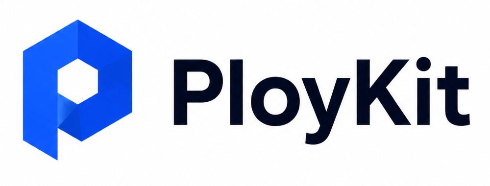

# PloyKit

<p align="center">
  
</p>

PloyKit is a module-first, white-label product host for SaaS apps, public tools, and internal operations. The host owns product routing, data, permissions, billing, files, AI/RAG, SEO, background work, and release gates. Product-specific behavior lives in trusted local source modules.

PloyKit modules are trusted local source modules. Runtime guards enforce permissions at the `ctx.*` capability API boundary, but PloyKit is not a Node.js sandbox for untrusted third-party code.

English | [中文](#中文)

## What You Can Build

- SaaS products assembled from configured module sources.
- Public utility sites backed by module APIs.
- Internal operations tools with admin, audit, files, billing, and jobs.
- White-label product shells where modules can contribute or replace selected surfaces.
- AI/RAG workflows that use host-managed providers and capability guards.

## Repository Layout

- `ploykit.config.json`: host configuration for module sources and trusted roots.
- `apps/host-next`: Next.js host application for public pages, dashboard, admin, auth, API routes, and shared UI.
- `src/lib/module-kernel`: small shared kernel for capability descriptors and runtime contracts.
- `src/lib/module-runtime`: module loading, routing, context creation, security guards, data access, and release helpers.
- `src/lib/module-capabilities`: host capability adapters for files, AI/RAG, HTTP egress, commercial flows, events, jobs, webhooks, notifications, and services.
- `src/module-sdk`: APIs used by module authors.
- `modules`: default workspace module source with reference modules and demos.
- `templates/modules`: starter templates for new modules.
- `docs`: Chinese guides for module development, contracts, deployment, runtime stores, security, and AI-assisted authoring.
- `scripts` and `tests`: module checks, smoke tests, runtime gates, and release gates.

## Module Sources

Modules are discovered from `moduleSources` in `ploykit.config.json`:

```json
{
  "moduleSources": [
    { "id": "workspace", "path": "modules" },
    { "id": "client-a", "path": "../client-a-ploykit-modules" }
  ],
  "trustedModuleRoots": [".", ".."]
}
```

Each source can point to one module root or to a directory that contains many module roots. Every module root must contain `module.ts`. A source outside the repository must be covered by `trustedModuleRoots`, because external modules are still executed as trusted local source.

After editing module sources or entry points, regenerate the runtime registry:

```bash
npm run modules:scan
```

For local development against a module outside this repository, use an ignored local
config via `PLOYKIT_CONFIG` instead of editing the tracked `ploykit.config.json`.
See `docs/external-module-local-development.zh-CN.md`.

Generated files:

- `src/lib/module-map.ts`: runtime import map for the host.
- `src/lib/module-map.manifest.json`: source metadata, hashes, release evidence, and quality declarations.

## Runtime Boundary

- Keep product-specific code inside a configured module root.
- Host and shared runtime code must not import concrete modules or hard-code module IDs.
- `src/lib/module-map.ts` and `src/lib/module-map.manifest.json` are generated registries, not hand-written host logic.
- Use `npm run host:boundary-check` to catch host/shared imports of concrete modules and module-specific root scripts.
- Use `ctx.*` capabilities from module handlers and declare matching permissions in `module.ts`.

## Included Modules

- `hello`: minimal runtime fixture and contract smoke module.
- `public-tools-demo`: public JSON, CSV, and text tools.
- `cms-demo`: CMS-style CRUD, files, posts, and notes.
- `shop-demo`: catalog, cart, commerce, and billing guard demo.
- `capability-demo`: host capabilities, jobs, events, webhooks, AI/RAG, and public route demo.
- `ai-rag-demo`: AI and RAG workflow demo.
- `white-label-site-demo`: branded site and presentation-layer override demo.

## Requirements

- Node.js `22.x` or newer.
- npm `10.x` or newer.
- Docker, if you want to run the local Postgres service used by `npm run db:up`.

## Quick Start

```bash
npm install
npm run db:up
npm run runtime:stores:migrate
npm run modules:scan
npm run host:dev
```

The Next.js host starts from `apps/host-next`.

## Module Workflow

```bash
npm run module:create -- my-module --template basic
npm run modules:scan
npm run module:doctor -- my-module
npm run module:test -- my-module
npm run modules:check
```

CLI targets can be a module id, a module root path, or `all`.

```bash
npm run module:doctor -- public-tools-demo
npm run module:test -- ../client-a-ploykit-modules/billing
npm run data:generate -- all
```

## Validation Before PRs

For typical module-only changes:

```bash
npm run typecheck
npm run modules:check
npm run catalog:doctor
npm run module:doctor -- <module-id>
npm run module:test -- <module-id>
```

Run host/product release gates when shared host runtime, Web Shell, public/auth/admin pages, or release policy changed:

```bash
npm run host:boundary-check
npm run test:web-shell
npm run release:integration-gate
npm run host:browser-matrix -- --required
npm run host:accessibility-smoke -- --required
```

Maintainer releases use:

```bash
npm run release:maintainer-gate
```

## Documentation

- [Chinese docs index](docs/README.zh-CN.md)
- [Module development](docs/module-development.zh-CN.md)
- [Module contract spec](docs/module-contract-spec.zh-CN.md)
- [AI-assisted module authoring](docs/ai-module-authoring.zh-CN.md)
- [Runtime stores](docs/runtime-stores.zh-CN.md)
- [Security model](docs/security-model.zh-CN.md)
- [Deployment](docs/deployment.zh-CN.md)

## Contributing

Contributions are welcome. Start with [CONTRIBUTING.md](CONTRIBUTING.md), keep product-specific changes inside a configured module root, and run the relevant validation commands before opening a PR.

For vulnerability reports, see [SECURITY.md](SECURITY.md).

## License

Apache-2.0. See [LICENSE](LICENSE).

## 中文

PloyKit 是一个模块优先的白牌产品宿主，适合 SaaS 应用、公开工具站和内部运营系统。宿主负责产品路由、数据、权限、计费、文件、AI/RAG、SEO、后台任务和发布门禁；具体产品行为放在可信本地源码模块中。

PloyKit 模块是可信本地源码模块。运行时会在 `ctx.*` 能力 API 边界执行权限约束，但 PloyKit 不是用来运行不可信第三方 Node.js 代码的沙箱。

## 可以构建什么

- 由配置模块源组合出来的 SaaS 产品。
- 由模块 API 驱动的公开工具站。
- 带 Admin、审计、文件、计费和任务系统的内部运营工具。
- 支持模块贡献或替换指定界面的白牌产品壳。
- 使用宿主管理的 Provider 和能力护栏运行 AI/RAG 工作流。

## 目录结构

- `ploykit.config.json`：模块源和可信根目录配置。
- `apps/host-next`：Next.js 宿主应用，包含公开页面、Dashboard、Admin、认证、API 路由和共享 UI。
- `src/lib/module-kernel`：能力 descriptor 和运行时契约使用的小型共享内核。
- `src/lib/module-runtime`：模块加载、路由、上下文、安全护栏、数据访问和发布辅助能力。
- `src/lib/module-capabilities`：文件、AI/RAG、HTTP 出站、商业化、事件、任务、Webhook、通知和服务等宿主能力适配器。
- `src/module-sdk`：模块作者使用的 SDK。
- `modules`：默认工作区模块源，包含参考模块和演示模块。
- `templates/modules`：新模块脚手架模板。
- `docs`：模块开发、契约、部署、运行时存储、安全和 AI 辅助开发文档。
- `scripts` 和 `tests`：校验脚本、冒烟测试、运行时门禁和发布门禁。

## 模块源

模块从 `ploykit.config.json` 的 `moduleSources` 中发现：

```json
{
  "moduleSources": [
    { "id": "workspace", "path": "modules" },
    { "id": "client-a", "path": "../client-a-ploykit-modules" }
  ],
  "trustedModuleRoots": [".", ".."]
}
```

每个 source 可以指向单个模块根目录，也可以指向包含多个模块根目录的父目录。每个模块根目录必须包含 `module.ts`。仓库外的 source 必须被 `trustedModuleRoots` 覆盖，因为外部模块仍会作为可信本地源码执行。

修改模块源或模块入口后，重新生成运行时注册表：

```bash
npm run modules:scan
```

生成文件：

- `src/lib/module-map.ts`：宿主运行时 import map。
- `src/lib/module-map.manifest.json`：源码元数据、哈希、发布证据和质量声明。

## 运行时边界

- 产品专属代码应放在配置的模块根目录内。
- 宿主和共享运行时代码不应导入具体模块，也不应硬编码模块 ID。
- `src/lib/module-map.ts` 和 `src/lib/module-map.manifest.json` 是自动生成的注册表，不是手写宿主逻辑。
- 使用 `npm run host:boundary-check` 检查宿主/共享代码是否引用了具体模块或模块专属根脚本。
- 模块处理器应通过 `ctx.*` 使用宿主能力，并在 `module.ts` 中声明匹配权限。

## 当前模块

- `hello`：最小运行时夹具和契约冒烟模块。
- `public-tools-demo`：公开 JSON、CSV 和文本工具。
- `cms-demo`：类 CMS 的 CRUD、文件、文章和笔记示例。
- `shop-demo`：目录、购物车、商业化和计费护栏示例。
- `capability-demo`：宿主能力、任务、事件、Webhook、AI/RAG 和公开路由示例。
- `ai-rag-demo`：AI 与 RAG 工作流示例。
- `white-label-site-demo`：品牌化站点和展示层替换示例。

## 运行要求

- Node.js `22.x` 或更新版本。
- npm `10.x` 或更新版本。
- 如需本地 Postgres，请安装 Docker 并使用 `npm run db:up` 启动服务。

## 快速开始

```bash
npm install
npm run db:up
npm run runtime:stores:migrate
npm run modules:scan
npm run host:dev
```

Next.js 宿主应用位于 `apps/host-next`。

## 模块开发流程

```bash
npm run module:create -- my-module --template basic
npm run modules:scan
npm run module:doctor -- my-module
npm run module:test -- my-module
npm run modules:check
```

CLI 目标可以是模块 ID、模块根目录路径或 `all`。

```bash
npm run module:doctor -- public-tools-demo
npm run module:test -- ../client-a-ploykit-modules/billing
npm run data:generate -- all
```

## 提交前验证

一般模块内改动：

```bash
npm run typecheck
npm run modules:check
npm run catalog:doctor
npm run module:doctor -- <module-id>
npm run module:test -- <module-id>
```

如果改到了共享宿主运行时、Web Shell、公开/认证/Admin 页面或发布策略，再运行宿主/产品级门禁：

```bash
npm run host:boundary-check
npm run test:web-shell
npm run release:integration-gate
npm run host:browser-matrix -- --required
npm run host:accessibility-smoke -- --required
```

维护者正式发布前运行：

```bash
npm run release:maintainer-gate
```

## 文档入口

- [中文文档索引](docs/README.zh-CN.md)
- [模块开发](docs/module-development.zh-CN.md)
- [module.ts 契约规范](docs/module-contract-spec.zh-CN.md)
- [AI 辅助模块开发](docs/ai-module-authoring.zh-CN.md)
- [运行时存储](docs/runtime-stores.zh-CN.md)
- [安全模型](docs/security-model.zh-CN.md)
- [部署说明](docs/deployment.zh-CN.md)

## 贡献

欢迎贡献。请先阅读 [CONTRIBUTING.md](CONTRIBUTING.md)，将产品专属改动保持在配置的模块根目录内，并在提交 PR 前运行相关验证命令。

漏洞报告请查看 [SECURITY.md](SECURITY.md)。

## 许可证

Apache-2.0。见 [LICENSE](LICENSE)。
