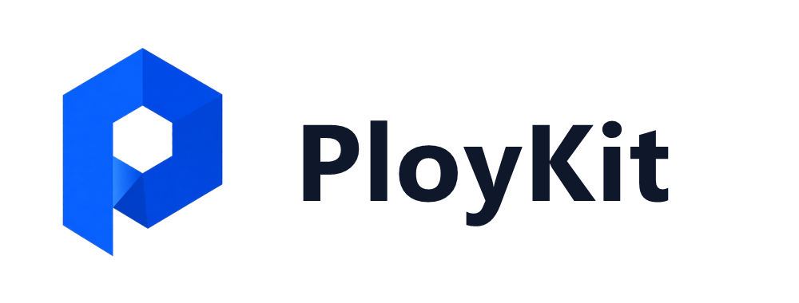

<p align="center">
  <picture>
    <source media="(prefers-color-scheme: dark)" srcset="docs/brand/logo-dark.png" />
    
  </picture>
</p>

# ploykit

ploykit is a Go + React full-stack framework for building multi-tenant SaaS products. It ships eleven business domains, two authorization layers (a cross-cutting RBAC layer and a self-contained strong-authorization profile), a set of platform packages, a contract toolkit, and a React client/UI layer. Dependencies are strictly one-way: **product → framework** — product repositories consume the framework, never the other way around.

## Features

### Business domains

Each domain ships application logic, repository adapters, HTTP adapters, and extension points (hooks):

| Domain | Provides |
|---|---|
| identity | Sign-up, verification-code login, revocable DB-backed sessions, personal access tokens |
| workspace | Members, invitations, share links, last-owner protection |
| billing | Plans, orders, subscriptions, entitlements, payment channels (Stripe and manual, with admin mark-paid settlement) |
| quota | Four-step pipeline: precheck → consume → meter → threshold notification |
| admin | Admin console API |
| notify | Notification port with dedupe policies and a mail adapter |
| audit | Operation audit with actor snapshots |
| analytics | Event tracking port |
| webhooks | Outbound webhooks: registerable event catalog, HMAC signing, SKIP LOCKED claiming, retry with backoff |
| schedule | User-defined schedules: kind registry, atomic DB-backed claims, queue-based delivery |
| settings | Site settings (announcements, maintenance mode, registration controls, rate limits) served to clients via `/config` |

### Authorization

Two independent, coexisting profiles — products pick per use case:

- `authz` (simple profile, cross-cutting) implements RBAC: a `domain:action` permission vocabulary (extensible by products), declarative route protection middleware, built-in owner/admin/member tier mapping, `*_own` owner-only conventions, `domain:*` wildcards, and workspace-scoped custom roles backed by Postgres.
- `authorization` (strong profile, self-contained — imports no other framework package): a YAML operation catalog (closed-set, deterministic hashing), a staged pure-function evaluator (authentication → scope → membership → role → policy → input) whose denials carry the failing stage and reason code, three-valued decisions (allow / deny / challenge) for step-up flows, and a rule registry with built-in assurance and recent-auth rules.

### Platform packages (18)

Zero-business-dependency packages; products import only what they use.

| Group | Packages |
|---|---|
| Core | `pg` (pool, transactional unit-of-work, replica reads, self-healing watchdog) · `pgmigrate` (migration runner: Up/Down/Status/hooks, advisory locking) · `pgpart` (monthly RANGE partition maintenance) · `webx` (middleware: rate limiting, CSRF, CORS, access log, security headers, recover, request ID, timeout, body limit; Principal) · `workers` (background worker lifecycle, health gating) |
| Events and scheduling | `events` (transactional events: enqueue in-transaction, subscribe-and-dispatch worker) · `cronx` (cron expression → next fire time, pure functions) |
| Security | `sealx` (AES-256-GCM credential sealing) · `egressx` (SSRF guard: private-network CIDRs, allowlists, DNS-rebinding-resistant dialing) |
| External connections | `redisx` (Redis client construction, GCRA rate limiter) · `storagex` (file storage: local atomic writes + S3) |
| Realtime | `wsx` (WebSocket hub: rooms, eviction, connection gauges) · `relayx` (cross-instance relay; memory and Redis transports) |
| Observability | `logx` (leveled structured logging) · `metrics` (`/metrics` endpoint, request metrics middleware) · `redactx` (secret redaction for free text) · `ids` (UUIDv7/v4 generation) |
| Rendering | `renderx` (SSR, prerendering, SEO engine) |

### Web frontend

- **@ploykit/client** — API + WebSocket client with zero React dependency: fetch wrapper with credential and CSRF handling (auto-attached on writes, bootstrapped via `/config`), WS client with reconnect backoff, event dedup, and scope subscriptions
- **@ploykit/ui** — React layer on top of the client: AppShell (collapsible sidebar), react-query data hooks, WS-to-query invalidation bridge, provider with built-in QueryClient, UI primitives. i18n is not built in: copy is prop-based, products choose their own i18n library
- **@ploykit/runtime** — isomorphic contract for the render-directive channel: route table as the single source of truth, SSR + hydration entry factories

### Extension points

Domains expose hooks with four execution semantics: **Transactional** (an error rolls back the whole operation), **Observational** (logging only), **Validating** (may block the operation), **Cleanup** (best-effort). The full table is in [docs/api-index.md](docs/api-index.md).

## Quickstart

The `example/` directory is a reference product wired to every domain. Prerequisites: Go, Node.js, Docker, Python 3 (standard library only).

```bash
make -C example db-up       # PostgreSQL on localhost:5437
make -C example backend     # Go API on http://localhost:8030
make -C example frontend    # Vite dev server on http://localhost:5173 (proxies to :8030)
```

Open http://localhost:5173 and register an account. In development the verification code is fixed by `DEV_CODE` (set to `000000` in the example targets).

Alternatively, run the whole stack in containers:

```bash
docker compose -f example/docker-compose.yml up -d --build   # app on http://localhost:8030
```

## Development

| Command | Purpose |
|---|---|
| `make verify` | Contract check + build + vet + test (includes the architecture boundary tests in `internal/arch`). Database-backed tests are skipped unless `TEST_DATABASE_URL` is set |
| `make -C example db-up` + `make test-db` | Full verification including database-backed tests (Postgres on localhost:5437) |
| `make check-api` | API contract drift gate: [docs/openapi.yaml](docs/openapi.yaml) ↔ route registration; fails on any mismatch in either direction |
| `make verify-ui` | Frontend component tests (`packages/ui`, requires `node_modules`) |

## Architecture

Repository layout:

```
ploykit/
├── identity/ … settings/   # business domains (11)
├── authz/                  # cross-cutting authorization (simple profile)
├── authorization/          # strong authorization profile (self-contained)
├── contractx/              # contract toolkit: deterministic hashing, manifests, OpenAPI ↔ route comparison
├── platform/               # 18 zero-business-dependency packages
├── packages/               # @ploykit/client, @ploykit/ui, @ploykit/runtime
├── migrations/             # framework SQL migrations (embedded), numbered 001–999
├── internal/               # framework internals, not importable by products (incl. the arch boundary tests)
├── example/                # reference product wiring every domain
├── docs/                   # design docs, API contract, ADRs
└── tools/                  # API contract drift checker
```

Key rules, all enforced by tests rather than convention: business domains never import each other (narrow documented exceptions) and never import identity — they decouple through hooks and transactional events; `platform/*` has zero business dependencies; `authorization` and `contractx` are self-contained (they import no other framework package); product migrations start at 1001.

Details: [docs/architecture.md](docs/architecture.md) — extension points: [docs/api-index.md](docs/api-index.md) — platform API surface: [docs/platform-api-index.md](docs/platform-api-index.md).

## Documentation

| Document | Contents |
|---|---|
| [docs/architecture.md](docs/architecture.md) | Design document: domains, hooks, platform packages, key decisions |
| [docs/api-index.md](docs/api-index.md) | Index of domain extension points (hooks); signatures live in each domain's `hooks.go` |
| [docs/platform-api-index.md](docs/platform-api-index.md) | Index of the platform API surface (middleware, helpers, ports) |
| [docs/openapi.yaml](docs/openapi.yaml) | API contract, checked against route registration by `tools/check_api.py` |
| [docs/adr/](docs/adr/) | Architecture decision records |
| [docs/rendering.md](docs/rendering.md) | Rendering layer: prerendering, runtime regeneration, SEO, hydration |
| [docs/pages.md](docs/pages.md) | Frontend page blueprints |
| [docs/component-selection.md](docs/component-selection.md) | Dependency selection rationale |
| [docs/agent-native.md](docs/agent-native.md) | Agent-native design (machine-oriented surfaces) |
| [docs/dev-environment.md](docs/dev-environment.md) | Development environment setup |
| [docs/ROADMAP.md](docs/ROADMAP.md) | Trigger-based registry of deferred work (trigger conditions + decided approach) |

## License

MIT — see [LICENSE](LICENSE).
