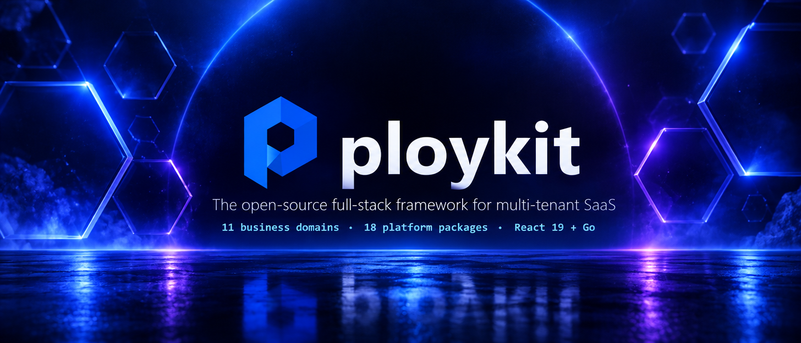
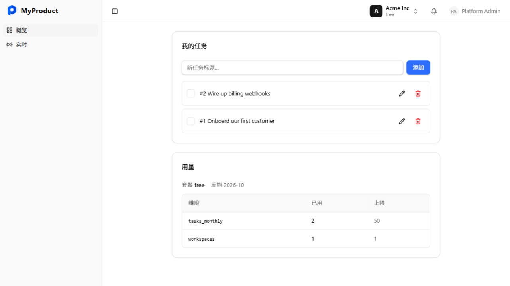
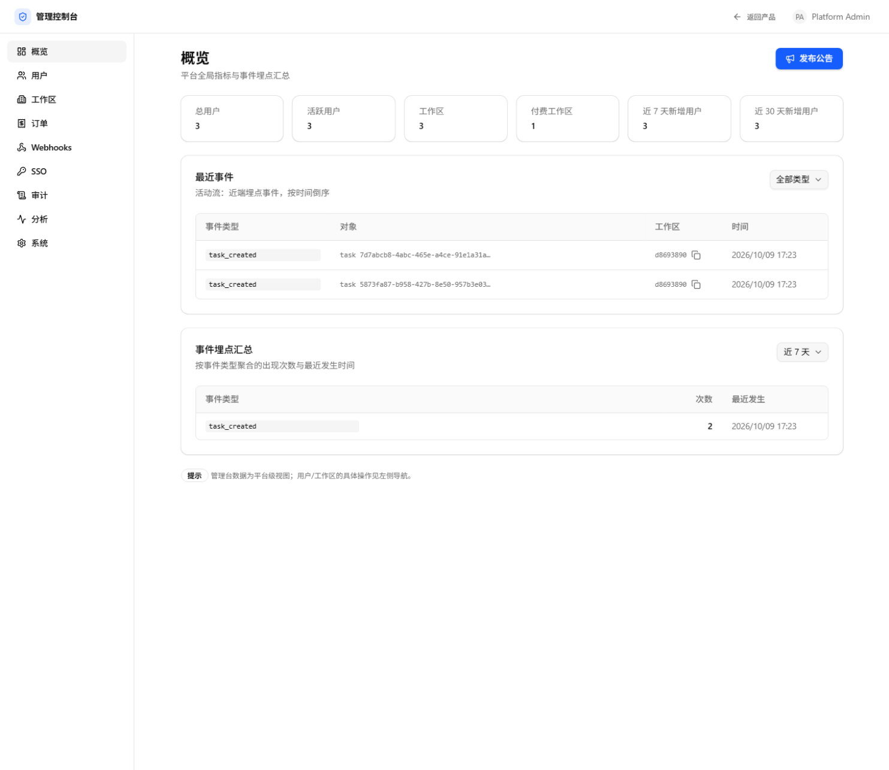
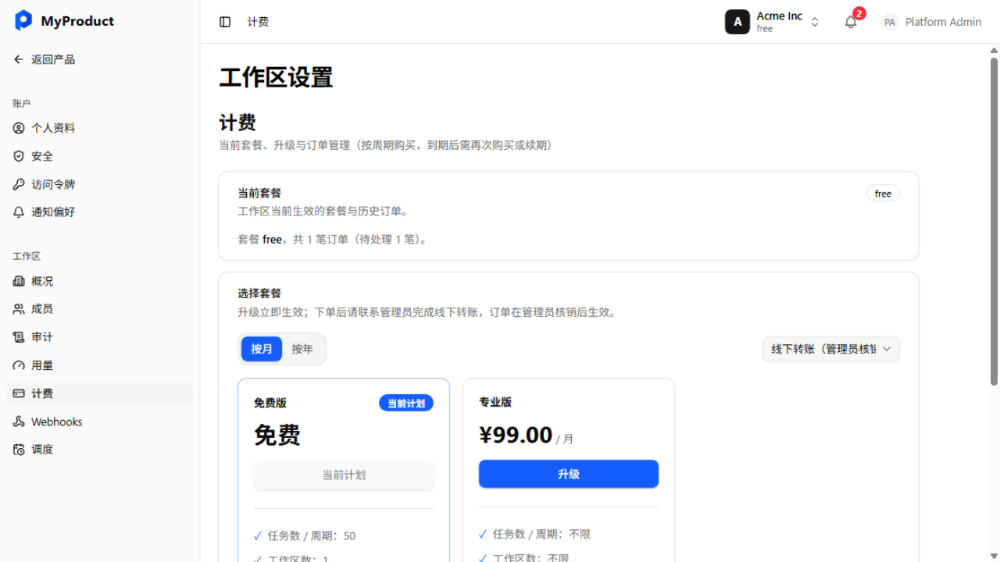
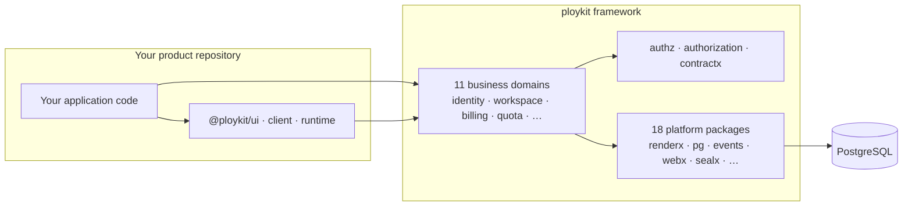

<p align="center">
  
</p>

<p align="center">
  <a href="https://github.com/haozing/ploykit/actions/workflows/ci.yml"></a>
  <a href="#-license"></a>
  
  
  
</p>

---

**ploykit** is a full-stack framework for building multi-tenant SaaS products: eleven production-grade business domains, a cross-cutting authorization layer, a strong-profile authorization engine, 18 platform packages, and a React 19 client/UI layer — wired end-to-end in a runnable example app.

Dependencies are strictly one-way: **product → framework**. Your repository consumes ploykit; ploykit never knows your product. That rule (and every other boundary) is enforced by architecture tests, not by convention.

## Why ploykit

- **Months of table-stakes work, already built.** Auth (password + OAuth + federated SSO), workspaces & membership, billing with Stripe and manual channels, quotas with reservations, notifications, audit trail, analytics, webhooks with retry and key rotation, scheduling, site settings — domain code you would otherwise write before writing *your* product.
- **Security is a gate, not a guideline.** Tenant isolation, CSRF, impersonation-safe sessions, egress SSRF protection, secret sealing, CSV-injection-safe exports — invariants pinned by architecture tests that fail the build when a boundary is crossed.
- **Production posture out of the box.** Prerendered SSR with versioned caching, River-backed transactional events, partitioned audit and analytics tables with retention workers, health and readiness probes, Prometheus metrics, structured logging with secret redaction.
- **A real app, not a toy.** The `example/` product exercises every domain — pages, API, migrations, and tests — and is the reference for how a product consumes the framework.

## What's inside

| Layer | What you get |
|---|---|
| **Business domains** (11) | identity · workspace · billing · quota · admin · notify · audit · analytics · webhooks · schedule · settings |
| **Cross-cutting** | `authz` (simple RBAC) · `authorization` (strong profile: YAML operation catalog, staged evaluator, allow / deny / **challenge**) · `contractx` (deterministic hashing, route and OpenAPI comparison) |
| **Platform packages** (18) | `renderx` (SSR + prerender + QuickJS sandbox) · `pg` (tenant-scoped pools) · `pgmigrate` · `pgpart` · `events` (River) · `webx` · `wsx` (WebSocket rooms) · `egressx` (SSRF-safe egress) · `sealx` (secret sealing) · `storagex` · `redactx` · `logx` · `metrics` · `workers` · `cronx` · `redisx` · `relayx` · `ids` |
| **Frontend** | `@ploykit/ui` (Base UI component system, 40+ pages) · `@ploykit/client` (typed API + CSRF + realtime) · `@ploykit/runtime` (hydration and prerender bridge) |

## Screenshots

| Product — tasks & usage | Platform admin console |
|---|---|
|  |  |

| Workspace billing — plans & manual channel |
|---|
|  |

## Extend it in minutes

Every domain exposes hooks. React to anything your product cares about in a
few lines — inside your own transaction boundary:

```go
import "github.com/haozing/ploykit/platform/events"

// react to a domain event emitted by the framework
events.Subscribe("task.created", func(ctx context.Context, ev events.Event) error {
    slog.Info("task created", "workspace", ev.WorkspaceID)
    return nil // return an error to fail the emitting transaction
})
```

That is the whole idea: the framework owns the machinery (tenancy, auth,
billing, quotas, events, rendering); your repository owns the product —
pages, product migrations (`1001+`), and the reactions that make it yours.
The [`example/`](example/) app is a complete, working demonstration.

## Architecture at a glance


```mermaid
graph LR
    subgraph Product["Your product repository"]
        APP["Your application code"]
        WEB["@ploykit/ui · client · runtime"]
    end
    subgraph Framework["ploykit framework"]
        DOMAINS["11 business domains<br/>identity · workspace · billing · quota · …"]
        CORE["authz · authorization · contractx"]
        PLATFORM["18 platform packages<br/>renderx · pg · events · webx · sealx · …"]
    end
    DB[("PostgreSQL")]

    APP --> WEB
    APP --> DOMAINS
    WEB --> DOMAINS
    DOMAINS --> CORE
    DOMAINS --> PLATFORM
    PLATFORM --> DB
```

Every arrow above is one-directional and enforced: the architecture tests fail the build if a domain imports another domain, if `platform/*` reaches into business code, or if a product page shadows a framework page.

## Quickstart

```bash
# 1. database (Docker)
make -C example db-up

# 2. backend (:8030, runs migrations, wires every domain)
make -C example backend

# 3. frontend dev server (:5173, proxies to :8030)
make -C example frontend
```

Open **http://localhost:5173**, register with the dev verification code `000000`, and the whole stack is yours. Prefer a single production-style binary? `make -C example build` prerenders the frontend and embeds it into one Go executable.

Full-stack verification:

```bash
go test ./...                             # unit gates (architecture boundaries included)
make -C example db-up && make test-db     # integration tests against PostgreSQL
make verify-ui                            # frontend component tests
python tools/check_api.py                 # OpenAPI ↔ route contract check
```

## Documentation

| Doc | Contents |
|---|---|
| [docs/architecture.md](docs/architecture.md) | Layering, domain map, hook model, boundary enforcement |
| [docs/api-index.md](docs/api-index.md) | Every domain extension point (25 hooks) with semantics |
| [docs/platform-api-index.md](docs/platform-api-index.md) | The full `platform/*` API surface |
| [docs/rendering.md](docs/rendering.md) | SSR, prerender, hydration, caching, sandboxing |
| [docs/pages.md](docs/pages.md) | Frontend page inventory and ownership rules |
| [docs/dev-environment.md](docs/dev-environment.md) | Toolchain, database, sealing keys, RLS playground |
| [docs/adr/](docs/adr/) | Architecture decision records |
| [docs/ROADMAP.md](docs/ROADMAP.md) | Trigger-based roadmap — what lands next and why not yet |

## Contributing

Issues and pull requests are welcome — see [CONTRIBUTING.md](CONTRIBUTING.md)
for the full setup and the architecture contract. The short version: the
architecture tests are the contract; if your change crosses a boundary on
purpose, update the ADR and the allowlist in the same PR. Security issues go
through [SECURITY.md](SECURITY.md), never public issues.

## License

MIT — see [LICENSE](LICENSE).
